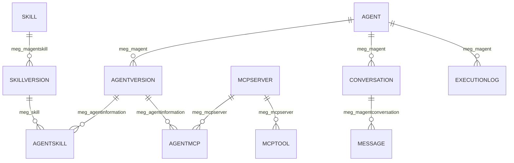

# Dataverse Field Updates

Use this file to capture the **final Dataverse table fields, lookup columns, and important notes** before Phase 2 starts.

Once this is filled, the runtime mappings in the codebase can be updated safely with minimal rework.

---

## How to use this file
For each table:
- add the real table logical name
- add the primary key field
- add the `tenantId` field name
- add all important business fields
- add lookup field names exactly as Dataverse exposes them
- note anything special such as option sets, JSON text fields, or required fields

---

## Global notes

### Tenant field
- Final `tenantId` field name: `meg_tenantid`
- Type: text / string
- Present on all tables? No
- Notes:
  - Present on: `meg_magent`, `meg_agentversion`, `meg_magentskill`, `meg_mcpserver`, `meg_agentkey`
  - Not currently listed on: `meg_agentskill`, `meg_skillinformation`, `meg_agentmcp`, `meg_mcptool`, `meg_conversation`, `meg_message`, `meg_executionlog`
  - Phase 2 must support **relation-based tenant enforcement**, not only direct `tenantId` filtering.

### API key header decision
- Header name: `x-api-key`
- Notes:
  - This matches the current runtime contract in Phase 1.
  - `x-tenant-id` should still be mandatory for tenant isolation.

### Conversation ID decision
- Will `conversationId` be external, internal, or both? **Not finalized**
- Notes:
  - No dedicated external conversation ID field is currently listed.
  - Safest Phase 2 approach is to use internal `meg_conversationid` unless an external ID field is added.
  - If external callers must reuse their own IDs, add a dedicated external ID field before implementing full persistence.

---

Note: fields might different

## 1. Agent
- Table logical name: meg_magent
- Primary key field: meg_magentid
- Tenant field: meg_tenantid
- Name field: meg_name
- Description field: meg_description
- Active version lookup field ~ this field don't exist
- Status field (if any): meg_status with this choice value
[
  { "label": "Draft", "value": 862070000 },
  { "label": "Active", "value": 862070001 },
  { "label": "Disabled", "value": 862070002 }
]

## 2. AgentVersion
- Table logical name: meg_agentversion
- Primary key field: meg_agentversionid
- Tenant field: meg_tenantid
- Agent lookup field: meg_magent (lookup to table meg_magent)
- Name field: meg_name
- System prompt field: meg_systemprompt
- Version field / label field ~ this field don't exist
- Status field (if any): statecode
- Model (text): meg_model
- Max Tokens (whole number): meg_maxtokens
- Temperature (whole number): meg_temperature
- Tools Schema (text): meg_toolschema

## 3. AgentSkill
- Table logical name: meg_agentskill
- Primary key field: meg_agentskillid
- Tenant field: ~ this field don't exist
- AgentVersion lookup field: meg_agentinformation (lookup to table meg_agentversion)
- SkillVersion lookup field: meg_skill (lookup to table meg_skillinformation)
- Ordering / priority field (if any): meg_order
- Is Required (boolean): meg_isrequired
- Name: meg_name

## 4. Skill
- Table logical name: meg_magentskill
- Primary key field: meg_magentskillid
- Tenant field: meg_tenantid
- Name field: meg_name
- Description: meg_description
- Type: meg_type with choice value
[
  { "label": "HTTP", "value": 862070000 },
  { "label": "Function", "value": 862070001 },
  { "label": "Other", "value": 862070002 }
]

## 5. SkillVersion
- Table logical name: meg_skillinformation
- Primary key field: meg_skillinformationid
- Skill lookup field: meg_magentskill (lookup to table meg_magentskill)
- Name field: meg_name
- URL field: meg_endpoint
- HTTP method field: meg_method with choice value
[
  { "label": "GET", "value": 862070000 },
  { "label": "POST", "value": 862070001 }
]
- Headers field: meg_headers (json schema)
- Input schema field: meg_inputschemas (json schema)
- Auth field(s) if any: meg_authconfig (json schema)
- Output schema field: meg_outputschemas (json schema)

## 6. AgentMCP
- Table logical name: meg_agentmcp   
- Primary key field: meg_agentmcpid
- Name field: meg_name
- AgentVersion lookup field: meg_agentinformation (lookup to table meg_agentversion)
- MCPServer lookup field: meg_mcpserver (lookup to table meg_mcpserver)

## 7. MCPServer
- Table logical name: meg_mcpserver
- Primary key field: meg_mcpserverid
- Tenant field: meg_tenantid
- Name field: meg_name
- Endpoint field: meg_endpoint
- Auth type field: meg_authconfig (json schema)

## 8. MCPTool
- Table logical name: meg_mcptool
- Primary key field: meg_mcptoolid
- MCPServer lookup field: meg_mcpserver (lookup to table meg_mcpserver)
- Name field: meg_name
- Description field: meg_description
- Input schema field: meg_inputschemas (json schema)
- Output schema field: meg_outputschemas (json schema)

## 9. ApiKey
- Table logical name: meg_agentkey
- Primary key field: meg_agentkeyid
- Tenant field: meg_tenantid
- Key field: meg_key
- Name / label field: meg_name

## 10. Conversation
- Table logical name: meg_conversation
- Primary key field: meg_conversationid
- Name field: meg_name
- Agent lookup field: meg_magent (lookup to table meg_magent)
- Context field (text): meg_context
- User Email: meg_useremail

## 11. Message
- Table logical name: meg_message
- Primary key field: meg_messageid
- Name field: meg_name 
- Conversation lookup field: meg_magentconversation (lookup to table meg_conversation)
- Role field: meg_role with choice value
[
  { "label": "user", "value": 862070000 },
  { "label": "assistant", "value": 862070001 },
  { "label": "tool", "value": 862070002 }
]

- Content field: meg_content
- Tool name field (if any): meg_toolname

## 12. ExecutionLog
- Table logical name: meg_executionlog
- Primary key field: meg_executionlogid
- Name field: meg_name  
- TraceId field: meg_traceid
- Agent lookup field: meg_magent (lookup to table meg_magent)
- Input field: meg_input (json schema)
- Output field: meg_output (json schema)
- Tools Used field: meg_toolsused (json schema)

---

## Relationship structure

### Business relationship map

### Table-to-table relation details

| From table | Lookup field | To table | Cardinality | Phase 2 use |
|---|---|---|---|---|
| `meg_agentversion` | `meg_magent` | `meg_magent` | many-to-one | Load versions for an agent |
| `meg_agentskill` | `meg_agentinformation` | `meg_agentversion` | many-to-one | Load skill links for an agent version |
| `meg_agentskill` | `meg_skill` | `meg_skillinformation` | many-to-one | Resolve linked skill version |
| `meg_skillinformation` | `meg_magentskill` | `meg_magentskill` | many-to-one | Resolve parent skill and tenant path |
| `meg_agentmcp` | `meg_agentinformation` | `meg_agentversion` | many-to-one | Load MCP links for an agent version |
| `meg_agentmcp` | `meg_mcpserver` | `meg_mcpserver` | many-to-one | Resolve MCP server |
| `meg_mcptool` | `meg_mcpserver` | `meg_mcpserver` | many-to-one | Load tools for an MCP server |
| `meg_conversation` | `meg_magent` | `meg_magent` | many-to-one | Enforce tenant via owning agent |
| `meg_message` | `meg_magentconversation` | `meg_conversation` | many-to-one | Persist conversation messages |
| `meg_executionlog` | `meg_magent` | `meg_magent` | many-to-one | Persist runtime execution logs |

### Dataverse lookup payload names expected in Web API

Use these when reading lookup values from Dataverse Web API responses:

| Table | Lookup column | Web API lookup property |
|---|---|---|
| `meg_agentversion` | `meg_magent` | `_meg_magent_value` |
| `meg_agentskill` | `meg_agentinformation` | `_meg_agentinformation_value` |
| `meg_agentskill` | `meg_skill` | `_meg_skill_value` |
| `meg_skillinformation` | `meg_magentskill` | `_meg_magentskill_value` |
| `meg_agentmcp` | `meg_agentinformation` | `_meg_agentinformation_value` |
| `meg_agentmcp` | `meg_mcpserver` | `_meg_mcpserver_value` |
| `meg_mcptool` | `meg_mcpserver` | `_meg_mcpserver_value` |
| `meg_conversation` | `meg_magent` | `_meg_magent_value` |
| `meg_message` | `meg_magentconversation` | `_meg_magentconversation_value` |
| `meg_executionlog` | `meg_magent` | `_meg_magent_value` |

---

## Query and relationship notes

### Agent loading path
- Agent -> Active AgentVersion:
  - `meg_magent` -> `meg_agentversion`
  - There is **no active version lookup field on Agent**.
- Notes:
  - Phase 1 assumed an `activeVersionLookup`; that assumption is now invalid.
  - Phase 2 must define how to select the runtime version.
  - Recommended rule: query `meg_agentversion` where `meg_magent = {agentId}` and filter by active state.
  - Open blocker: decide whether there can be multiple versions and how one version becomes the runtime version.

### Skill loading path
- AgentVersion -> AgentSkill -> SkillVersion:
  - `meg_agentversion.meg_agentversionid`
  - -> `meg_agentskill.meg_agentinformation`
  - -> `meg_agentskill.meg_skill`
  - -> `meg_skillinformation.meg_skillinformationid`
  - -> optional parent skill via `meg_skillinformation.meg_magentskill`
- Notes:
  - `meg_agentskill` has no listed tenant field.
  - `meg_skillinformation` also has no listed tenant field.
  - Tenant isolation should be enforced through `meg_agentversion` / `meg_magent` and optionally validated against parent skill `meg_magentskill`.
  - `meg_order` and `meg_isrequired` are available for execution priority and required-tool behavior in Phase 2.

### MCP loading path
- AgentVersion -> AgentMCP -> MCPServer -> MCPTool:
  - `meg_agentversion.meg_agentversionid`
  - -> `meg_agentmcp.meg_agentinformation`
  - -> `meg_agentmcp.meg_mcpserver`
  - -> `meg_mcpserver.meg_mcpserverid`
  - -> `meg_mcptool.meg_mcpserver`
- Notes:
  - `meg_agentmcp` and `meg_mcptool` have no listed tenant field.
  - Tenant filtering must be inherited from `meg_agentversion` / `meg_magent` and validated against `meg_mcpserver.meg_tenantid`.

### API key validation path
- ApiKey query details:
  - Query `meg_agentkey` by `meg_key` and `meg_tenantid`
- Notes:
  - Current listed schema does not show an active flag, expiration field, or status field.
  - Basic validation for Phase 2 is possible.
  - Full security hardening from Phase 2 will remain partial unless status / expiration metadata exists or is added.

### Conversation and message persistence path
- Conversation query details:
  - Load/save `meg_conversation` by `meg_conversationid`
  - Tenant should be enforced through `meg_magent -> meg_magent.meg_tenantid`
- Message query details:
  - Load/save `meg_message` by `meg_magentconversation`
  - Role values map to:
    - user = `862070000`
    - assistant = `862070001`
    - tool = `862070002`
- Notes:
  - Neither `meg_conversation` nor `meg_message` lists a direct tenant field.
  - The runtime should not trust conversation IDs without verifying the linked agent tenant.

---

## Final decisions needed before Phase 2
- Which fields are required for runtime only?
  - Required now:
    - `meg_magent.meg_magentid`, `meg_magent.meg_tenantid`, `meg_magent.meg_name`
    - `meg_agentversion.meg_agentversionid`, `meg_agentversion.meg_magent`, `meg_agentversion.meg_systemprompt`
    - `meg_agentskill.meg_agentinformation`, `meg_agentskill.meg_skill`
    - `meg_skillinformation.meg_skillinformationid`, `meg_skillinformation.meg_endpoint`, `meg_skillinformation.meg_method`
    - `meg_agentmcp.meg_agentinformation`, `meg_agentmcp.meg_mcpserver`
    - `meg_mcpserver.meg_mcpserverid`, `meg_mcpserver.meg_endpoint`
    - `meg_agentkey.meg_key`, `meg_agentkey.meg_tenantid`
  - Required for persistence in Phase 2:
    - `meg_conversation.meg_conversationid`, `meg_conversation.meg_magent`
    - `meg_message.meg_magentconversation`, `meg_message.meg_role`, `meg_message.meg_content`
    - `meg_executionlog.meg_traceid`, `meg_executionlog.meg_magent`
- Which fields are optional?
  - `meg_description`, `meg_headers`, `meg_authconfig`, `meg_outputschemas`, `meg_toolschema`, `meg_context`, `meg_useremail`, `meg_toolname`, `meg_name` on link tables.
- Which fields contain JSON text?
  - `meg_skillinformation.meg_headers`
  - `meg_skillinformation.meg_inputschemas`
  - `meg_skillinformation.meg_authconfig`
  - `meg_skillinformation.meg_outputschemas`
  - `meg_agentversion.meg_toolschema`
  - `meg_mcpserver.meg_authconfig`
  - `meg_mcptool.meg_inputschemas`
  - `meg_mcptool.meg_outputschemas`
  - `meg_executionlog.meg_input`
  - `meg_executionlog.meg_output`
  - `meg_executionlog.meg_toolsused`
- Which fields are lookups returned as `_fieldname_value`?
  - `_meg_magent_value`
  - `_meg_agentinformation_value`
  - `_meg_skill_value`
  - `_meg_magentskill_value`
  - `_meg_mcpserver_value`
  - `_meg_magentconversation_value`
- Which tables need status filtering?
  - `meg_magent` using `meg_status`
  - `meg_agentversion` using `statecode`
  - Any other table with state/status columns should be confirmed before coding
- Which records should be considered active/inactive?
  - `meg_magent`: Active = `862070001`, ignore Draft and Disabled for runtime invocation
  - `meg_agentversion`: must confirm `statecode` meaning in this environment before implementation
  - `meg_agentkey`: no active/inactive field listed yet

---

## Phase 2 readiness assessment

| Area | Status | Assessment |
|---|---|---|
| Core table names identified | Ready | Enough to begin mapping updates |
| Core lookup paths identified | Ready | Relationship chain is clear enough for service redesign |
| Direct tenant filtering on all tables | Not ready | Several tables do not expose `meg_tenantid` |
| Agent -> active version resolution | Blocked | No active version lookup on `meg_magent` |
| API key hardening | Partial | Key + tenant works, but no active/expiry field is listed |
| Conversation persistence design | Partial | Tables exist, but `conversationId` strategy is not finalized |
| Execution log persistence | Ready | Required fields exist for basic logging |

### Can we proceed to Phase 2?

**Yes, with constraints.** Phase 2 can start now for mapping refactor, relation-based query design, persistence wiring, and runtime hardening. However, full completion should not be considered final until these blockers are resolved:

1. Decide how the runtime selects the active `meg_agentversion` for an agent.
2. Decide whether `conversationId` is internal only or needs a dedicated external ID field.
3. Confirm whether `meg_agentkey` needs status / expiration fields for full security hardening.

### Constraints to proceed

| Constraint | Impact on Phase 2 | What to do |
|---|---|---|
| No active version lookup on `meg_magent` | Runtime cannot deterministically load the correct agent version using the current Phase 1 logic | Define one rule: either use one active `meg_agentversion` by `statecode`, or add a dedicated active-version lookup field |
| `meg_tenantid` is missing on several tables | Direct tenant filtering is not possible everywhere | Implement relation-based tenant validation through parent records such as `meg_magent`, `meg_agentversion`, `meg_magentskill`, and `meg_mcpserver` |
| `conversationId` strategy is not finalized | Conversation persistence may not match external caller expectations | Decide whether API callers pass internal `meg_conversationid` or whether a new external ID field is needed |
| `meg_agentkey` has no active / expiration metadata listed | Security hardening is limited to key + tenant match only | Either accept minimal validation for now or add status / expiration fields before final hardening |
| `statecode` meaning for `meg_agentversion` is not confirmed | Active/inactive version filtering may be implemented incorrectly | Confirm the actual `statecode` values in Dataverse before coding production filters |
| JSON schema fields exist across multiple tables | Runtime parsing can fail if payload format is inconsistent | Standardize expected JSON structure for headers, auth config, input schema, output schema, and tool logs |
| `meg_mcptool` does not list method/path fields like Phase 1 assumed | MCP tool execution model from Phase 1 does not directly match final schema | Redesign MCP tool mapping to use actual fields only, or add missing execution metadata if required |

### Suggested actions

#### Must do now
1. Update `src/config/dataverseMappings.ts` to replace all temporary `crd_*` names with the real `meg_*` names.
2. Refactor `src/services/dataverseService.ts` so tenant isolation works through relationship chains where direct `meg_tenantid` is unavailable.
3. Replace Phase 1 active-version lookup logic with an explicit query strategy for `meg_agentversion`.
4. Map Dataverse lookup fields using `_meg_*_value` properties consistently.
5. Update API key validation to match the actual `meg_agentkey` fields instead of assumed `isActive` logic.

#### Should do next
1. Implement real persistence for `meg_conversation`, `meg_message`, and `meg_executionlog`.
2. Add parsing helpers for JSON schema/text fields with safe fallback behavior.
3. Add status filtering for `meg_magent`, and for `meg_agentversion` after confirming `statecode` values.
4. Rework MCP mapping and execution based on the final `meg_mcpserver` and `meg_mcptool` structure.
5. Add tests for tenant isolation, active version selection, conversation ownership checks, and runtime loading paths.

#### Recommended schema confirmations before final release
1. Confirm whether only one active `meg_agentversion` can exist per agent.
2. Confirm `statecode` values for `meg_agentversion`.
3. Confirm whether `meg_agentkey` needs `status`, `expireson`, or `revokedon` fields.
4. Confirm whether `meg_conversation` needs an external conversation ID field.
5. Confirm whether MCP tools need extra execution metadata beyond name, description, and schemas.

### Practical recommendation

Proceed with Phase 2 using this implementation order:

1. Replace the temporary mappings in the runtime with the real `meg_*` tables and fields.
2. Refactor tenant enforcement to use parent relations where `meg_tenantid` is missing.
3. Implement persistence for `Conversation`, `Message`, and `ExecutionLog`.
4. Finalize active-version selection logic.
5. Add tests against the finalized relationship paths.

---

## Handoff note
After this file is completed, update these code files:
- `src/config/dataverseMappings.ts`
- `src/services/dataverseService.ts`
- any related DTO or validation logic impacted by the final field names
